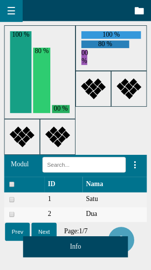
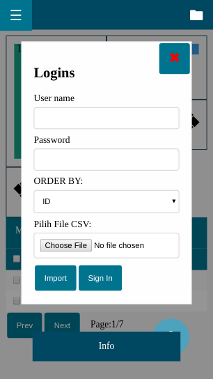
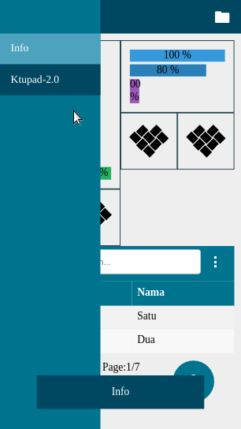

# Ktupad View
Ktupad CSS Framework  
Ktupad MVC Framework

## Import Aplikasi
1. Clone https://github.com/ktupad/view.git
2. Beri nama viewapp atau nama yang tersedia, lalu klik Begin Import

## Koneksi Cloud
1. Login ke https://my.gearhost.com/account/login
2. Add Cloud, pilih nama viewapp atau nama yang tersedia, pilih Free, lalu Create Cloudsite
3. Pilih Cloud, klik Publish, klik Github, lalu Authorize, klik Repository, lalu klik Activate.

## menjalankan Aplikasi
1. Jalankan aplikasi http://viewapp.gearhostpreview.com/

Done.

